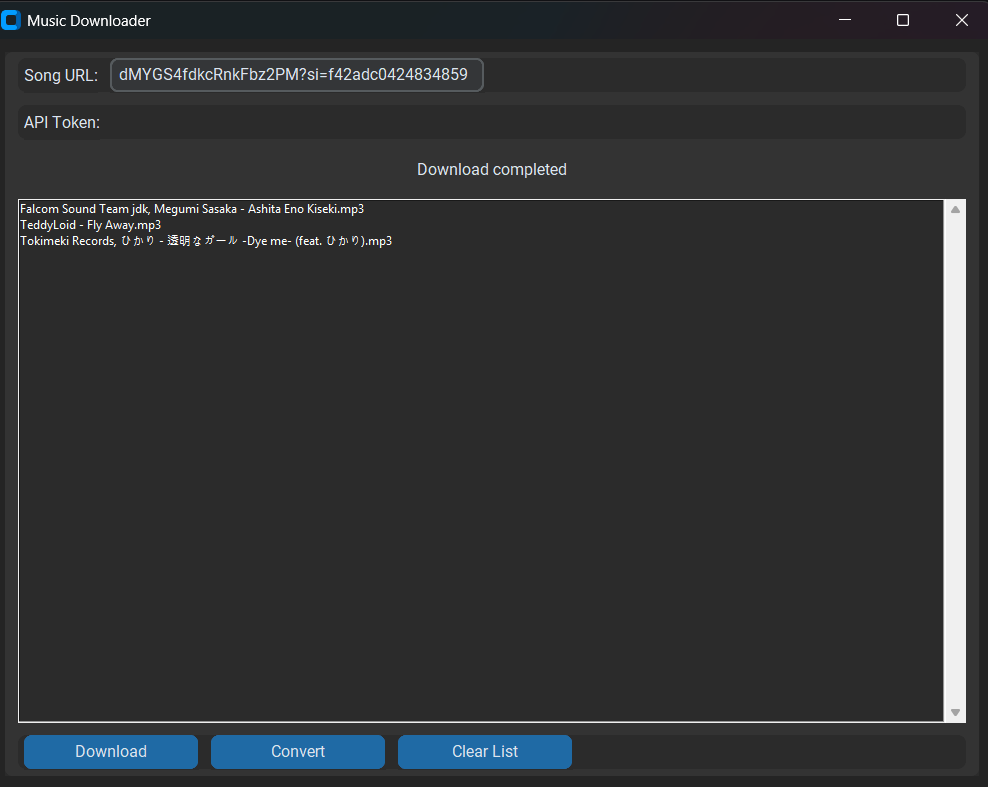
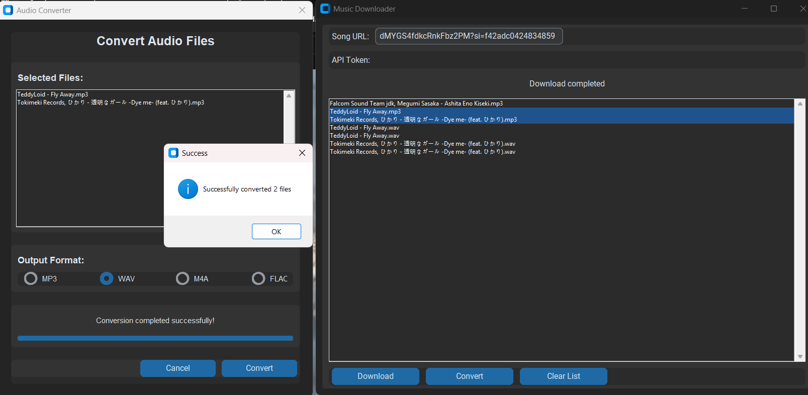

# 🎵 Just Another Song Downloader 🎵

**Your friendly neighborhood music downloader!** This app helps you grab tunes from Spotify and (possibly) Yandex Music, convert them into different formats, and keep them organized. All while looking pretty slick! 
Supports spotify songs, albums, and playlists!

  



---

## 🌟 Features You’ll Love

- 🎶 **Download Songs**:  
  - **Spotify**: Grab tracks with `spotdl`.  
  - **Yandex Music**: (Uh... maybe? It’s untested for now due to country restrictions. 😅).  

- 🔄 **Audio Conversion**:  
  - Turn your tunes into MP3, WAV, M4A, or FLAC. Powered by the magic of FFmpeg! ✨

- 📂 **File Management**:  
  - Organizes downloads into `downloads` and `converted` folders for a tidy library. 🗂️  
  - Keep track of all your downloaded and converted songs in the app.  

- 🎨 **Sleek Design**:  
  - Dark-mode friendly UI made with CustomTkinter. Because dark mode is life. 🌙  

- 🪵 **Logging**:  
  - A handy `music_downloader.log` file keeps track of all the action!  

---

## 🛠️ How to Set It Up

### 🧾 Prerequisites
1. **Python 3.9+**: Make sure Python is ready to go! 🐍  
2. **Install Stuff**: Run this to install all the dependencies:  
   ```bash
   pip install -r requirements.txt
   ```
3. **Get FFmpeg**: Download and add it to your system PATH. (Google it if you're stuck!) 🌐  
4. **Spotify Tool**: You’ll need `spotdl` for Spotify downloads.  
   ```bash
   pip install spotdl
   ```
5. **Optional - Yandex Music**: Want to try your luck? Install this:  
   ```bash
   pip install yandex-music
   ```

---

## 🎉 Let’s Get Started

1. **Run It!** 🏃  
   ```bash
   python app.py
   ```

2. **Choose Your Platform**:  
   - Click on **Spotify** or **Yandex Music** (if you’re feeling adventurous).  

3. **Download Time**:  
   - Paste the song URL, enter your Yandex API token (if needed), and hit that **Download** button! 🎧  

4. **Convert Your Tunes**:  
   - Select a song, pick your preferred format, and voilà – new file ready to jam! 🎵  

5. **Organize Like a Pro**:  
   - Easily browse, delete, or convert your downloaded songs right in the app.  

---

## 🛠️ Customize It Your Way

Open the `config.json` file to tweak settings like output folders, default formats, or download limits. Example:  

```json
{
  "output_dir": "downloads",
  "converted_dir": "converted",
  "supported_formats": ["mp3", "wav", "m4a", "flac"],
  "default_format": "mp3",
  "max_concurrent_downloads": 3,
  "spotify_bitrate": "128k",
  "spotify_threads": 4
}
```

---

## 🐞 Known Quirks & Features (For Now)

- **Yandex Music**: Uncharted waters due to regional restrictions. Proceed with caution! ⚠️  
- **FFmpeg/spotdl Dependency**: The app can’t work its magic without these tools installed.  

---

## 🤝 Wanna Contribute?  

1. Fork the repo 🍴  
2. Make your changes (and maybe add emojis 🐙).  
3. Submit a pull request and we’ll take a look!  

---

## 📝 License  

Feel free to use this app however you like! It’s licensed under the MIT License. 🎉  

---
